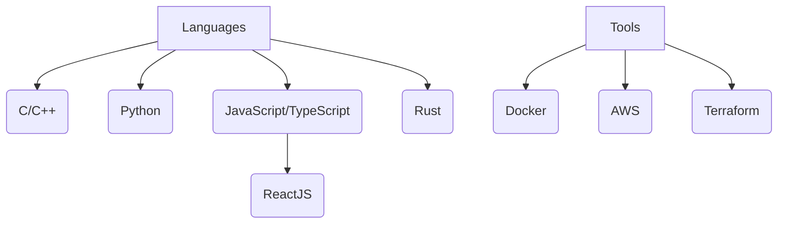

# Hi there 👋

I’m **Tom**, a passionate IT student at **Epitech** (European Institute of Technology), specializing in **DevOps** and **Security**. I love to explore and work with modern technologies and keep up-to-date with the latest trends in the industry.

## 🛠️ Tech Stack:

📈 **Current Learning:**
- 
- 
- 
- 
- 

## 💻 Pentesting
I’m into pentesting and security, always on the lookout for vulnerabilities and improvements in security measures!

## 🌍 Travels:
I love traveling and have visited:
- 🇺🇸 USA
- 🇪🇸 Spain
- 🇮🇹 Italy
- 🇬🇧 England
- 🇵🇹 Portugal
- 🇹🇭 Thailand
- 🇶🇦 Qatar

## 🎮 Hobbies:
- Fashion 👗
- Motorcycle 🏍️
- Sports 🏋️‍♂️
- Pop culture 🎥

## 🚀 Fun Fact:
If I had a dollar for every Kubernetes pod I’ve deployed, I’d be competing with Elon for Mars!

## 📟 Diagram: My Technology Stack

